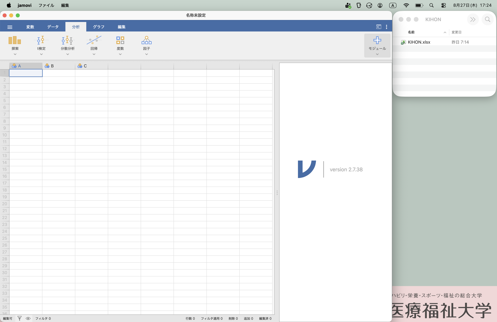
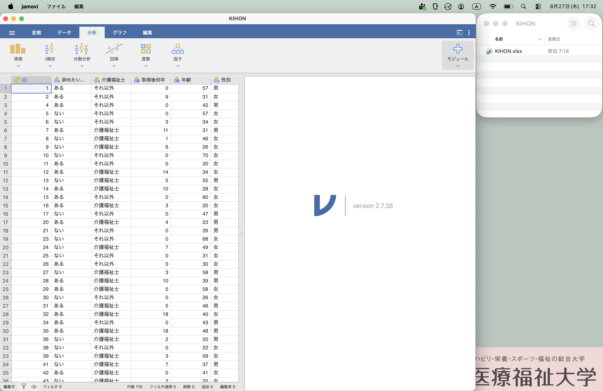
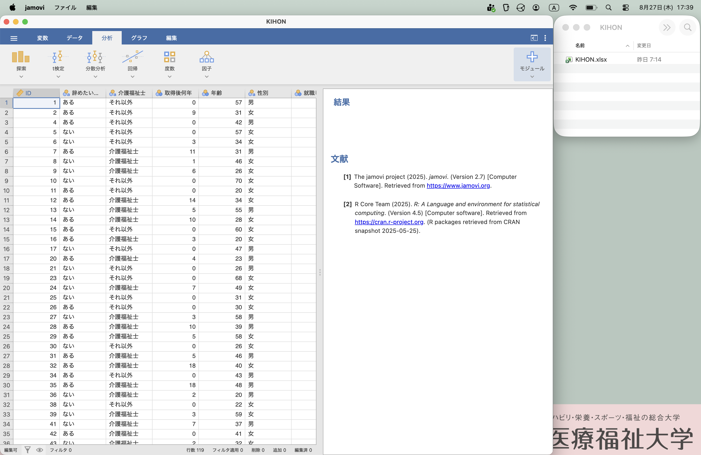
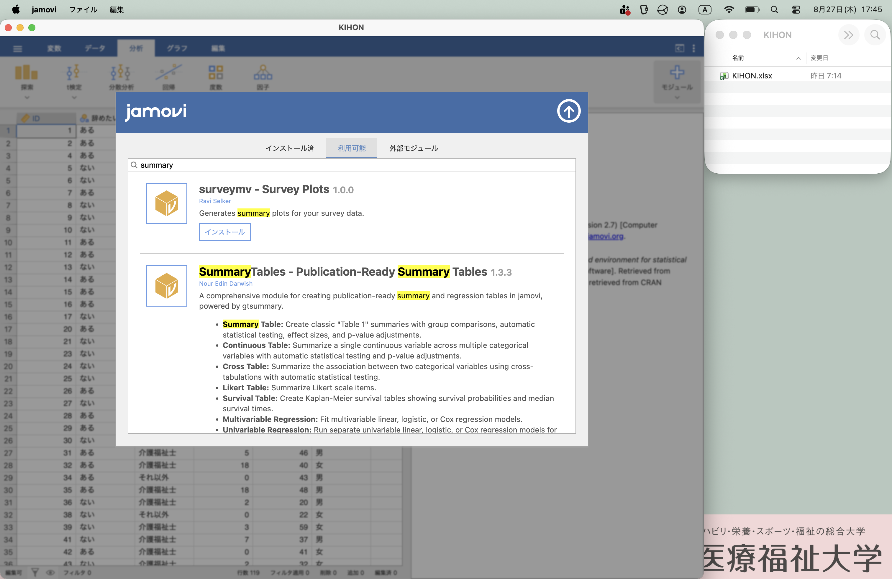
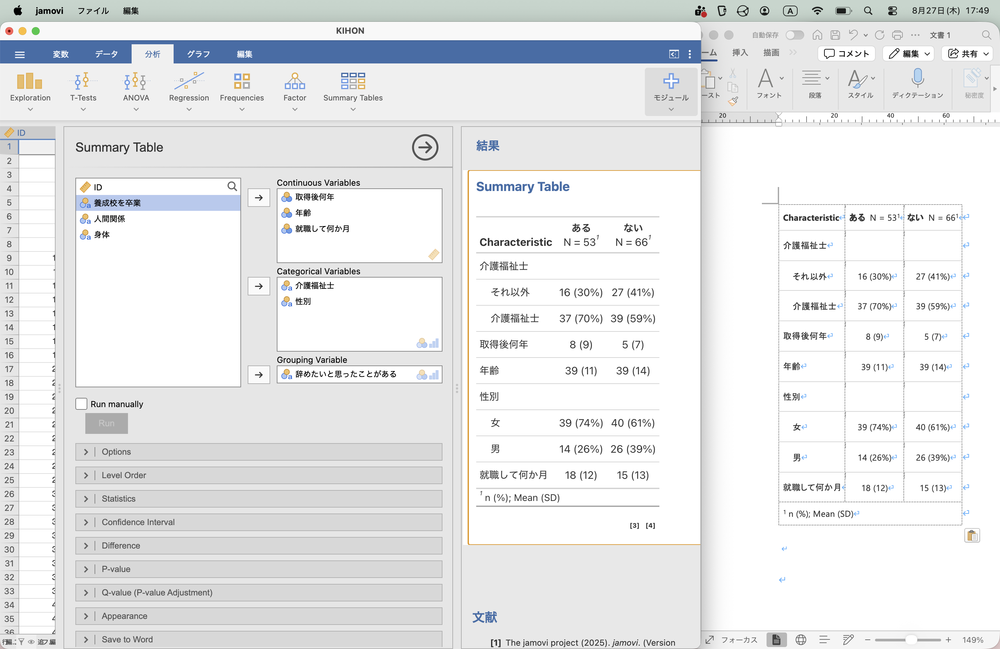
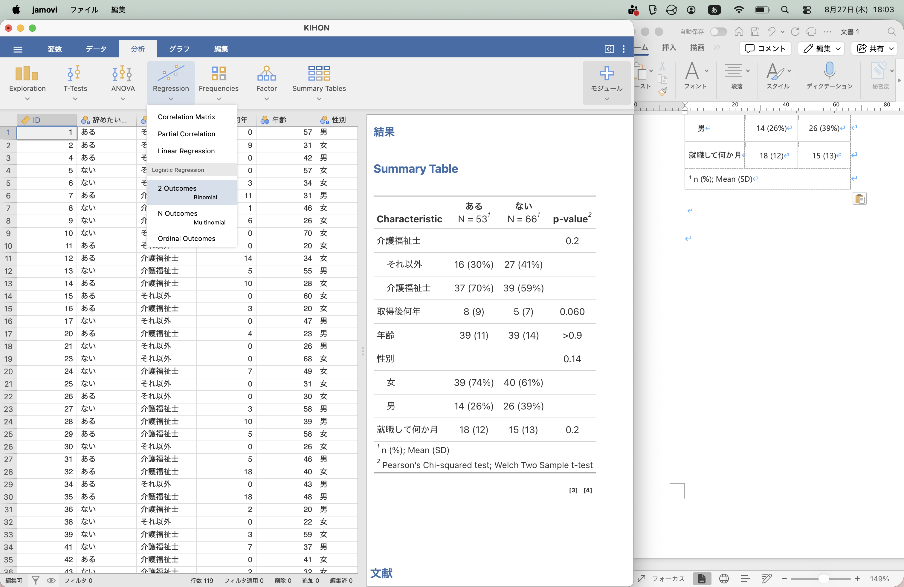
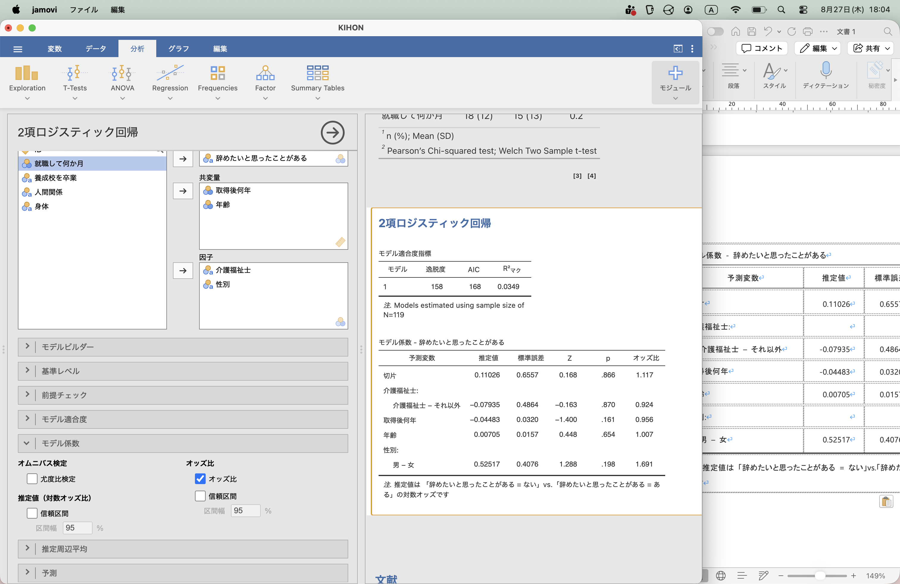

```{r include=FALSE}
library(readxl) 
library(DT) 
library(dplyr) 
library(ggplot2) 
library(colorspace) 
library(gt) 
library(gtsummary) 
library(labelled) 
df <- read_excel("../data/KIHON.xlsx", sheet = "仮説データ")

```

## はじめに

**今日のゴール**

- アンケートを「集計」ではなく「研究」として考えられる
- 「何を明らかにしたいか」から、アウトカムと説明変数を決められる
- AIやJAMOVIを使って、ロジスティック回帰の結果を読める

### スケジュール

- 13:00 アンケート論文を読んでみよう
  - 廣田ら, ロジスティック回帰分析法を活用した保険薬局における患者満足度の要因分析, 医療薬学, 45 巻 (2019) 4 号
  - https://doi.org/10.5649/jjphcs.45.214
- 13:20 計算してみよう
  - Ａ群は20%、B群は10%。Ａ群はＢ群の何倍？
  - ○○比＝1.0 とは、1.0 倍のこと
- 13:40 ロジスティック回帰の簡単な紹介
- 14:00 アンケート論文を解釈してみよう
- 14:20 アンケートを集計から研究に！
  - 主要アウトカム（従属変数、目的変数）は何？
  - 独立変数（共変量）は何？
- 14:40 AI でロジスティック回帰
- 15:00 JAMOVI でロジスティック回帰
- 15:20 英語論文も読んでみよう
  - Liu W, Puts M, Jian F, Zhou C, Tang S and Chen S (2020) Physical frailty and its associated factors among elderly nursing home residents in China
  - https://kyorin.pages.dev/crosssectional_liu.html
- 15:40 論文を書こう - STROBE 声明
- 16:00 終わり

## アンケート論文を読んでみよう

- 教科書の分析と論文の分析が違う！
- 調査の仕方を学ぶ前に、調査の読み方を知りたい！

廣田ら, ロジスティック回帰分析法を活用した保険薬局における患者満足度の要因分析, 医療薬学, 45 巻 (2019) 4 号, https://doi.org/10.5649/jjphcs.45.214


### 研究とは

このアンケートを、研究にアップグレードしましょう。

注：本来は、データより先に行うべきことを、今回はデータ収集後に行っています。

### 目的を決める

原則として、分析する前に「何を明らかにしたいか」を決めます。

注：今回はデータ収集後に研究の問いを設定しています。実際の研究では、研究目的や仮説を事前に設定することが望まれます。

例: 全体評価 (= $y$) は、挨拶 (= $x_1$) と関係があるのではないか？

### y を一つだけに決め、二値型 (生/死, YES/NO) にする

研究では、まず「何を明らかにしたいか」を1つ決める

- y を 全体評価 とする。
- 「大変満足」を「高評価」、それ以外を「それ以外」の二値化する。
- y で主要アウトカムとする。

### 新しい用語

- 二値型: 「生/死」や「男/女」など、二つしか値がない型。なお、アンケートの「よい・ふつう・わるい」は、「よい」「それ以外」とすると二値型になる。年齢は、「65歳未満」「65歳以上」とすると二値型になる。
- **アウトカム** 従属変数、目的変数、$y$: アンケートの調査項目のうち、最も重要なもので二値型 (例：総合評価は「大変満足」か「その他」)。ひとつだけ (多くても二つ)。
- 独立変数、説明変数、$x_1, x_2, ...$: アウトカムと関連すると仮定している質問項目。二値型でも数値でもよい。たくさんあってよい。

::: {.question-box}


### 計算問題  第 1 問: 何倍？


- 挨拶「大変良い」の何%が総合評価「大変満足」？
- 挨拶「その他」の何%が総合評価「大変満足」？
- 挨拶「大変良い」は、「その他」の、何倍「大変満足」になる？


|              | 「大変満足」 | 「それ以外」 | 小計 |
| ------------ | -----------: | -----------: | ---: |
| 「大変良い」 | 56           | 93           | 149  |
| 「それ以外」 | 23           | 250          | 273  |
| 小計         | 79           | 343          | 422  |

(注: 実際のデータではありません)

:::


### 答え合わせ

- 挨拶「大変良い」の何%が総合評価「大変満足」？
$ 56 / (56+93) = 37.6% $ 
- 挨拶「その他」の何%が総合評価「大変満足」？
$ 23 / (23 + 250) = 8.4% $
- 挨拶「大変良い」は、「その他」の、何倍「大変満足」になる？
$ 37.6 / 8.4 = 4.48倍 $

これがリスク比です。

なぜ「何倍」だけではダメなのか？

2 つの要因が同時に関係しているとき、単純な比較だけでは他の要因の影響を除けません。

- そこで、複数の項目を同時に扱う
- ロジスティック回帰
- ロジスティック回帰に出てくるのは**オッズ比**

### 計算問題  第 2 問: オッズを計算してみよう

- 挨拶「大変良い」のオッズは？
$ 56 / 93 = ... $
- 挨拶「その他」のオッズは？
$ 23 / 250 = ... $
- 挨拶「大変良い」は、「その他」の、何倍「大変満足」になる？
$ ... / ... = 6.52 $

### ロジスティック回帰

| 質問項目 | オッズ比 |
| -------- | -------: |
| 職員の挨拶 | 6.89 |
| 職員の態度 | 2.58 |
| 薬剤師による説明 | 3.16 |
| 分かりやすい言葉 | 0.74 |
| 待ち時間 | 2.82 |
| 薬局の環境 | 1.52 |
| プライバシー | 0.95 |

- リスク比ではなくオッズ比
- 項目間の影響を考慮

解釈例：患者が聞きたいことの「薬剤師が説明」が「大変良い」と総合評価が2〜3倍「大変満足」になる。

## 基本のキ

### アンケート調査

[ アンケートの目的 ]...あえて伏せておきます

以下のようなアンケートを行ったとします。

- Q. 1 年齢
- Q. 2 性別
- Q. 3 介護福祉士か
- Q. 4 介護福祉士をとって何年か
- Q. 5 養成校を卒業したか
- Q. 6 今の職場に就職して何ヶ月か
- Q. 7 辞めようと思ったことはあるか
- Q. 8 人間関係は良いか
- Q. 9 身体的につらくないか


### アンケートの単純集計

単純集計（統計学では記述統計などと言われます）では、以下のように行います。

性別

```{r dev="ragg_png", echo=FALSE}
ggplot(
  df,
  aes(x = "", fill = to_factor(性別))
) +
  geom_bar(width = 1, color = "white") +
  coord_polar(theta = "y") +
  labs(fill = var_label(df$性別)) +
  theme_void()
```

### 単純集計は、クロス集計表にまとめる

- 円グラフ（パイチャート）は使わない
- 表 (数値) で良い
- むしろ、表の方が良い

### クロス集計

主要アウトカム（従属変数, 目的変数）別に対象者の特徴をまとめた表を、「記述統計表（descriptive statistics table）」などと呼びます。

```{r, echo=FALSE}
dfShow <- df
dfShow$Riyousha_ID <- NULL

dfShow$性別 <- to_factor(dfShow$性別)
dfShow$辞めたいと思ったことがある <- to_factor(dfShow$辞めたいと思ったことがある)
dfShow$養成校を卒業 <- to_factor(dfShow$養成校を卒業)
dfShow$人間関係 <- to_factor(dfShow$人間関係)
dfShow$身体 <- to_factor(dfShow$身体)

tbl <- gtsummary::tbl_summary(
  data = dfShow,
  include = c(年齢, 介護福祉士, 取得後何年, 就職して何か月, 養成校を卒業, 辞めたいと思ったことがある, 人間関係, 身体),
  by = 性別
)
tbl <- modify_header(tbl, label ~ "")
tbl
```
### 何で分けるか？

上の例では、「性別」で２群に分けて、その他の項目を男女別に分けています。

なぜ性別で分けたのでしょうか？

上の「記述統計表」では、「主要アウトカム」で分けていないので、わかりづらくなっているのです。

「主要アウトカム」で分けてみましょう。

```{r, echo=FALSE}
tbl <- gtsummary::tbl_summary(
  data = dfShow,
  include = c(年齢, 介護福祉士, 取得後何年, 就職して何か月, 養成校を卒業, 性別, 人間関係, 身体),
  by = 辞めたいと思ったことがある
)
tbl <- modify_header(tbl, label ~ "")
tbl
```

## クロス集計の統計

大学で学ぶのは、カイ二乗検定と Fisher の正確性検定です。これを行うと、 p 値が計算されます。

```{r, echo=FALSE}
tbl <- add_p(tbl)
tbl
```

ここから解釈できることは、男女差はあるとは言えなさそうということです。

### 他の要素を考慮したオッズ比

ここで「仮説」に戻ります。

例: 「辞めたいと思ったことがある」 (= $y$) のは、「人間関係」 (= $x$) と関係があるのではないか？

これが、違ったということになります。


### 研究にアップグレード

::: {.big-statement}

**目的：介護の仕事を「辞めたいと思ったことがある」と関連のある項目を明らかにする。**

:::

関連があると仮定する項目：

- 介護福祉士
- 取得後何年
- 就職して何か月
- 養成校を卒業
- 人間関係が良くない
- 身体的につらい

調整因子：アウトカムとの関連を考えるときに、その影響を考慮したい項目。

- 年齢
- 性別

本人の意思で変えられないけれども影響がありそうな項目は、調整因子と考えるとよいでしょう。


**ここまで考えてから、アンケートの質問項目を考える。**

### AI でロジスティック回帰

ChatGPT でも Gemini でも、なんでも良いので、エクセルファイルに以下のように入力してみてください。


::: {.callout-note}
エクセルファイルをアップするので、「辞めたいと思ったことがある~介護福祉士+取得後何年+年齢+性別+就職して何か月+養成校を卒業」で、ロジスティック回帰して。
:::


主要アウトカム：辞めたいと思ったことがある

関連すると仮定している項目：介護福祉士, 取得後何年, 就職して何か月, 養成校を卒業

調整因子：年齢, 性別


### JAMOVI でロジスティック回帰

Windows 版があります。

GMAIL など、ウェブメールを使っている人は、インストールせずにすぐに使うこともできますが、英語版のみです。

可能であれば、インストールしましょう。オンライン参加者は、佐々木（兵庫県立大）がサポートします。










::: {.takehome-box}

## 今日、持ち帰ってほしい 5 つ

01　目的を決める
「何を明らかにしたいのか？」

02　アウトカムを決める
まず y を決める。

03　説明変数を考える
「何が関係していそうか？」

04　解析する
必要ならロジスティック回帰。

05　結果を解釈する
AIに計算させても、解釈するのは自分。

:::

これが全てではありませんし、この通りにならないときもあります。そのような内容は、基本の「ほ」にて。

毎週水曜朝7:00-8:00に、Zoom で朝活しています。「熊本からきました」と言って、ふらっと遊びにきてください (ミーティングID: 878 7350 8375,パスコードは「朝」の英語です。)。


