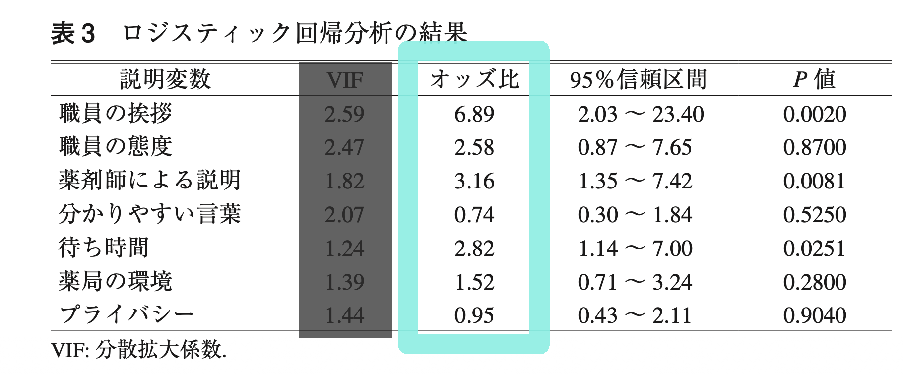

```{r include=FALSE}
library(readxl) 
library(DT) 
library(dplyr) 
library(ggplot2) 
library(colorspace) 
library(gt) 
library(gtsummary) 
library(labelled) 
df <- read_excel("../data/KIHON.xlsx", sheet = "仮説データ")

```

## 自己紹介

- 馬場美彦 ... 講師 
- 住永みどり ... 現地スタッフ
- 佐々木毅然 ... オンラインスタッフ
- 石川莉子 ... オンラインスタッフ

## はじめに

**今日のゴール**

- アンケートを「集計」ではなく「研究」として考えられる
- 「何を明らかにしたいか」から、アウトカムと説明変数を決められる
- AIやJAMOVIを使って、ロジスティック回帰の結果を読める

::: {.lecture-box}

### 準備

- [KIHON.xlsx](../data/KIHON.xlsx) ... 練習用アンケート結果エクセルファイル
- [JAMOVI](https://www.jamovi.org/index.html) ... 統計ソフトウェア
- [アンケート分析論文の例](https://doi.org/10.5649/jjphcs.45.214) ... 廣田ら, ロジスティック回帰分析法を活用した保険薬局における患者満足度の要因分析, 医療薬学, 45 巻 (2019) 4 号, https://doi.org/10.5649/jjphcs.45.214

:::

### スケジュール

- 13:05 アンケート論文を読んでみよう
  - 廣田ら, ロジスティック回帰分析法を活用した保険薬局における患者満足度の要因分析, 医療薬学, 45 巻 (2019) 4 号
  - https://doi.org/10.5649/jjphcs.45.214
- 13:20 計算してみよう
  - Ａ群は20%、B群は10%。Ａ群はＢ群の何倍？
  - ○○比＝1.0 とは、1.0 倍のこと
- 13:40 ロジスティック回帰の簡単な紹介
- 14:00 アンケート論文を解釈してみよう
- 14:20 アンケートを集計から研究に！
  - 主要アウトカム（従属変数、目的変数）は何？
  - 独立変数（予測因子、説明変数、共変量）は何？
- 14:40 AI と JAMOVI でロジスティック回帰
- 14:50 質問コーナー
- (おまけ) 英語論文も読んでみよう
  - Liu W, Puts M, Jian F, Zhou C, Tang S and Chen S (2020) Physical frailty and its associated factors among elderly nursing home residents in China
  - https://kyorin.pages.dev/crosssectional_liu.html
- 15:40 論文を書こう - STROBE 声明
- 15:45 閉会

## アンケート論文を読んでみよう

研究に興味をもって、教科書や実際の論文を読んでみた時、こう思いませんでしたか？

- 論文って難しい！
- 教科書の分析と論文の分析が違う！
- 調査の仕方を学ぶ前に、調査の読み方を知りたい！

## 研究とは

このアンケートを、研究にアップグレードしましょう。

注：本来は、データより先に行うべきことを、今回はデータ収集後に行っています。

::: {.lecture-box}

### 目的は明確に、結果でブレない

原則として、**分析する前** に「何を明らかにしたいか」を決めます。

介護事業において、職員が辞めたいと思う原因を探りたい。


-良くない例 1: 「辞めたいと思う理由を明らかにする」
-良くない例 2 
  - 目的：「辞めたいと思う理由を明らかにするために、何が原因なのかを明らかにする」
  - 分析結果：「職歴が長い職員ほど、上司に不満を持っていることがわかった」
  - → 目的は「辞めたいと思う理由」なのに、結果は「上司に不満」に変わっている
-良い例: 「辞めたいと思う理由」(= $y$) は、「職場の雰囲気」 (= $x_1$)と「身体的なつらさ」(= $x_2$)に関係があるのではないか？

:::

### y を一つだけに決め、二値型 (生/死, YES/NO) にする

研究では、まず「何を明らかにしたいか」を1つ決める

- y を目的と一致させる。例：「辞めたいと思う理由」とする。
- y を「主要アウトカム」（従属変数, 目的変数）とする。
- ロジスティック回帰では、の二値化する。例：「思ったことがある」、「思ったことはない」

### 新しい用語

- 二値型: 「生/死」や「男/女」など、二つしか値がない型。なお、アンケートの「よい・ふつう・わるい」は、「よい」「それ以外」とすると二値型になる。年齢は、「65歳未満」「65歳以上」とすると二値型になる。
- **アウトカム** 従属変数、目的変数、$y$: アンケートの調査項目のうち、研究で結果として説明したいもの（目的）で二値型 (例：総合評価は「大変満足」か「その他」)。ひとつだけ。
- 予測因子、独立変数、説明変数、共変量 $x_1, x_2, ...$: アウトカムと関連すると仮定している質問項目。二値型でも数値でもよい。複数あってよい。
- 交絡因子、$z_1, z_2, ...$: 予測因子とアウトカムの両方に関連する変数。複数あってよい。

\[
y ~ x_1 + x_2 + ... + z_1 + z_2 + ...
\]


::: {.question-box}

### 計算問題  第 1 問: 何倍？

廣田ら, ロジスティック回帰分析法を活用した保険薬局における患者満足度の要因分析, 医療薬学, 45 巻 (2019) 4 号, https://doi.org/10.5649/jjphcs.45.214

目的：患者満足度調査の「総合評価」において，最も高い評価をされた方とそれ以外の回答をされた方を2 値の目的変数として設定し，それに対してほかの要因がどれだけ影響しているのかを算出した．

結果：患者満足度調査に同意を得た500 名の患者にアンケート用紙を配布し，自発的に回収を行い，「総合評価」に回答があった422 名分を有効回答とし，以下の分析に供した．有効回答率は84.4％であった．

- 職員の挨拶「大変良い」の何%が総合評価「大変満足」？
- 職員の挨拶「その他」の何%が総合評価「大変満足」？
- 職員の挨拶「大変良い」は、「その他」の、何倍「大変満足」になる？


|              | 「大変満足」 | 「それ以外」 | 小計 |
| ------------ | -----------: | -----------: | ---: |
| 「大変良い」 | 56           | 93           | 149  |
| 「それ以外」 | 23           | 250          | 273  |
| 小計         | 79           | 343          | 422  |

(注: 実際のデータではありません)

:::


### 答え合わせ

- 職員の挨拶「大変良い」の何%が総合評価「大変満足」？
\[ 56 / (56+93) = 37.6% \]
- 職員の挨拶「その他」の何%が総合評価「大変満足」？
\[ 23 / (23 + 250) = 8.4% \]
- 職員の挨拶「大変良い」は、「その他」の、何倍「大変満足」になる？
\[ 37.6 / 8.4 = 4.48倍 \]

これがリスク比です。

なぜ「何倍」だけではダメなのか？

2 つの要因が同時に関係しているとき、単純な比較だけでは他の要因の影響を除けません。

- そこで、複数の項目を同時に扱う
- ロジスティック回帰
- ロジスティック回帰に出てくるのは**オッズ比**

### 計算問題  第 2 問: オッズを計算してみよう

- 挨拶「大変良い」のオッズは？
\[ 56 / 93 = ... \]
- 挨拶「その他」のオッズは？
\[ 23 / 250 = ... \]
- 挨拶「大変良い」は、「その他」の、何倍「大変満足」になる？
\[ ... / ... = 6.52 \]

### ロジスティック回帰



今日は、オッズ比だけをみましょう。


解釈例：患者が聞きたいことの「薬剤師による説明」が「大変良い」と「総合評価」が2〜3倍「大変満足」になる。

## 基本のキ

### アンケート調査

[ アンケートの目的 ]...あえて伏せておきます

以下のようなアンケートを行ったとします。

- Q. 1 年齢
- Q. 2 性別
- Q. 3 介護福祉士か
- Q. 4 介護福祉士をとって何年か
- Q. 5 養成校を卒業したか
- Q. 6 今の職場に就職して何ヶ月か
- Q. 7 辞めようと思ったことはあるか
- Q. 8 人間関係は良いか
- Q. 9 身体的につらくないか

[KIHON.xlsx](../data/KIHON.xlsx) ... 練習用アンケート結果エクセルファイルです。こちらをダウンロードして、演習しましょう。

なお、統計ソフトウェアでは、「はい」「いいえ」などはそのままで OK です。0,1 などコード化する必要はありません。

### アンケートの単純集計

単純集計（統計学では記述統計などと言われます）では、以下のように行います。

性別

```{r dev="ragg_png", echo=FALSE}
ggplot(
  df,
  aes(x = "", fill = to_factor(性別))
) +
  geom_bar(width = 1, color = "white") +
  coord_polar(theta = "y") +
  labs(fill = var_label(df$性別)) +
  theme_void()
```

### 単純集計は、クロス集計表にまとめる

- 円グラフ（パイチャート）は使わない
- 表 (数値) で良い
- むしろ、表の方が良い

### クロス集計

主要アウトカム（従属変数, 目的変数）別に対象者の特徴をまとめた表を、「記述統計表（descriptive statistics table）」などと呼びます。

```{r, echo=FALSE}
dfShow <- df
dfShow$Riyousha_ID <- NULL

dfShow$性別 <- to_factor(dfShow$性別)
dfShow$辞めたいと思ったことがある <- to_factor(dfShow$辞めたいと思ったことがある)
dfShow$養成校を卒業 <- to_factor(dfShow$養成校を卒業)
dfShow$人間関係 <- to_factor(dfShow$人間関係)
dfShow$身体 <- to_factor(dfShow$身体)

tbl <- gtsummary::tbl_summary(
  data = dfShow,
  include = c(年齢, 介護福祉士, 取得後何年, 就職して何か月, 養成校を卒業, 辞めたいと思ったことがある, 人間関係, 身体),
  by = 性別
)
tbl <- modify_header(tbl, label ~ "")
tbl
```
### 何で分けるか？

上の例では、「性別」で２群に分けて、その他の項目を男女別に分けています。

なぜ性別で分けたのでしょうか？

上の「記述統計表」では、「主要アウトカム」で分けていないので、わかりづらくなっているのです。

主要アウトカムである「辞めたいと思ったことがある」で分けてみましょう。

```{r, echo=FALSE}
tbl <- gtsummary::tbl_summary(
  data = dfShow,
  include = c(年齢, 介護福祉士, 取得後何年, 就職して何か月, 養成校を卒業, 性別, 人間関係, 身体),
  by = 辞めたいと思ったことがある
)
tbl <- modify_header(tbl, label ~ "")
tbl
```

## クロス集計の統計

大学で学ぶのは、カイ二乗検定と Fisher の正確性検定です。これを行うと、 p 値が計算されます。

```{r, echo=FALSE}
tbl <- add_p(tbl)
tbl
```

ここから解釈できることは、男女差はあるとは言えなさそうということです。

### 他の要素を考慮したオッズ比

ここで「仮説」に戻ります。

例: 「辞めたいと思ったことがある」 (= $y$) のは、「人間関係」 (= $x$) と関係があるのではないか？

これが、違ったということになります。


### 研究にアップグレード

::: {.big-statement}

**目的：介護の仕事を「辞めたいと思ったことがある」と関連のある項目を明らかにする。**

:::

関連があると仮定する項目：

- 介護福祉士
- 取得後何年
- 就職して何か月
- 養成校を卒業
- 人間関係が良くない
- 身体的につらい

調整因子：アウトカムとの関連を考えるときに、その影響を考慮したい項目。

- 年齢
- 性別

本人の意思で変えられないけれども影響がありそうな項目は、調整因子と考えるとよいでしょう。


**ここまで考えてから、アンケートの質問項目を考える。**

### AI でロジスティック回帰

::: {.ai-prompt}
**PROMPT**

エクセルファイルをアップします。

主要アウトカム：
「辞めようと思ったことがある」

説明変数：
「介護福祉士」
「取得後何年」
「年齢」
「性別」
「就職して何か月」
「養成校を卒業」

これらを用いてロジスティック回帰分析を行ってください。
オッズ比、95%信頼区間、p値を示してください。
:::

- 主要アウトカム：辞めたいと思ったことがある
- 関連すると仮定している項目：介護福祉士, 取得後何年, 就職して何か月, 養成校を卒業
- 調整因子：年齢, 性別

プロンプトは、こう書いても良いです。

::: {.ai-prompt}
「辞めようと思ったことがある~介護福祉士+取得後何年+年齢+性別+就職して何か月+養成校を卒業」で、ロジスティック回帰して。
:::


### JAMOVI でロジスティック回帰

Windows 版があります。

GMAIL など、ウェブメールを使っている人は、インストールせずにすぐに使うこともできますが、英語版のみです。

可能であれば、インストールしましょう。オンライン参加者は、佐々木（兵庫県立大）がサポートします。


患者背景などを表にするモジュール Summary Table をインストールしましょう。
まずは、右上の Module をクリックします。
SummaryTables を検索して、インストールします。


「分析」タブに、SummaryTables が出てきます。
ここで、Grouping Variable に、この研究の目的で設定した**主要アウトカム** (従属変数, 目的変数) を設定します。

独立変数は、数値は Continuous Variables、男女のような因子型は Categorical Variables に入れます。
入れるたびに、表が変わっていくのが見えるかと思います。


最後に、ロジスティック回帰を実行してみましょう。
Regression から 2 Outcomes を選択します。


モデル係数のところで、「オッズ比」にチェックを入れておきます。
あとは、SummaryTables と同様に変数を右に設定します。


::: {.takehome-box}

## 論文の書き方

### アンケートには STROBE 声明

[https://www.equator-network.org/wp-content/uploads/2015/10/STROBE-Exp-JAPANESE.pdf](https://www.equator-network.org/wp-content/uploads/2015/10/STROBE-Exp-JAPANESE.pdf)

いちぶを抜粋

- 1. タイトルと抄録
  - 1(a)タイトルまたは抄録の中で研究デザインを一般に用いられている用語で明示する。
- 7. 変数 (variables)：すべてのアウトカム、曝露、予測因子（predictor）、潜在的な交絡因子 (potential confounder)、潜在的な効果指標の修飾因子 (potential effect modifier) を明確に定義する。
- 16. おもな結果 (main results)
  - 16(a)調整前 (unadjust) の推定値、該当する場合は交絡因子での調整後の推定値、および、それらの精度（例：95%信頼区間）を記述する。どの交絡因子がなぜ調整されたかを明確にする。
  - 16(b) 連 続 変 数 が カ テ ゴ リ ー 化 さ れ て い る と き は カ テ ゴ リ ー の 境 界 値 (category boundaries) を報告する。
  
## 今日、持ち帰ってほしい 5 つ

01　目的を決める
「何を明らかにしたいのか？」

02　「何」がアウトカムになる
y は二値型

03　説明変数を考える
「何が関係していそうか？」

04　解析する
必要ならロジスティック回帰。

05　結果を解釈する
AI に解析させても、解釈するのは自分。

:::

これが全てではありませんし、この通りにならないときもあります。そのような内容は、基本の「ほ」にて。

毎週水曜朝7:00-8:00に、Zoom で朝活しています。「熊本からきました」と言って、ふらっと遊びにきてください (ミーティングID: 878 7350 8375,パスコードは「朝」の英語です。)。


